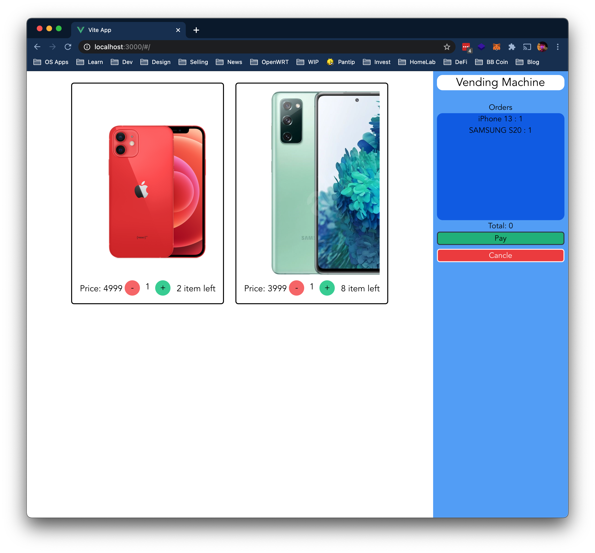

# KiFlask

Preview app
```bash
  docker compose -f docker-compose.dev.yml up
```
You might get an error. It's not stable version yet.

## TODOs

 - [x] Inital project
 - [x] Design DB
 - [x] Setup FrontEnd
 - [x] Product Controller
 - [x] Machine Controller
 - [] Order Controller
 - [] Authorize
 - [] Backend Handle HTTP method and error
 - [] Optimize Database query performance
 - [] Fix ORM Model dependencies

App Image.


